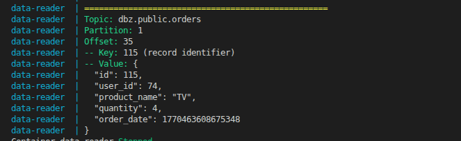

# kafka_hw_04

## Тема работы
"Настройка Debezium Connector для передачи данных из PostgreSQL в Apache Kafka с использованием механизма CDC." 

## Требования
- ОС Linux (использовалась Ubuntu 22.04.5 LTS)
- Docker и Docker Compose (использовались версии 28.4.0 и 2.39.4)
- Make

## Установка

```bash
git clone git@github.com:A-Rogachev/kafka_hw_04.git
cd kafka_hw_04
```

## Команды для взаимодействия с приложением

| Команда | Действие | Комментарий|
|----------|----------|----------|
| <b>make</b> | Запуск кластера | запускает кластер и генерацию данных |
| <b>make reading</b> | Запуск консьюмера | консьюмер в интерактивном режиме читает из топика |
| <b>make stop</b>|Остановка приложения|удаление контейнеров и томов данных образов |
| <b>make check</b>|Проверка работы контейнеров| псевдоним для <b>docker compose ps -a</b> |
| <b>make data_logs</b>|Проверка работы записи в бд| выводит на консоль информацию о записи в бд |

* Пример вывода информации о чтении сообщения из топика:


## Kafka UI

Интерфейс после запуска приложения доступен на [http://localhost:8080](http://localhost:8080)

## Grafana Dashboard

Интерфейс после запуска приложения доступен на [http://localhost:3000](http://localhost:3000)
* логин/пароль: admin/admin

## Примечания

- Для остановки консьюмера (работает в интерактивном режиме) -> `Ctrl+C`
- Приложение написано на python 3.11.6
- Переменные окружения для настройки представлены в файле env.example
- Для продюсера и потребителей использован образ на основе <b>python:3.11-slim</b>
- Для кластера kafka использован образ <b>confluentinc/cp-kafka:7.0.1</b>
